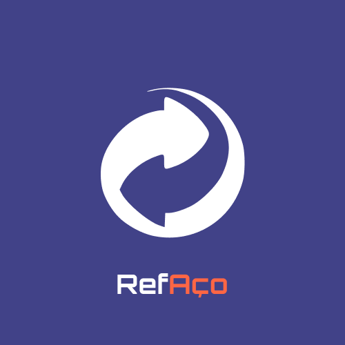
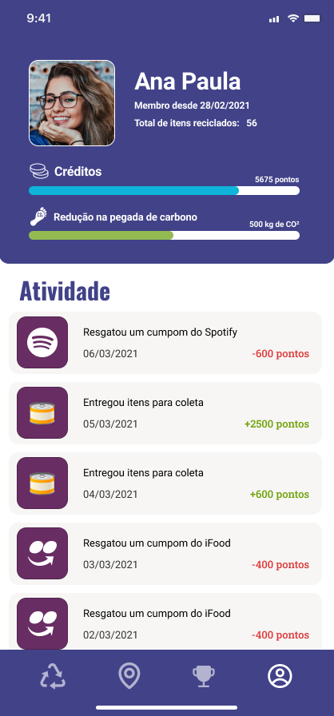

# refaço

<!-- PROJECT LOGO -->
<br />
<p align="center">
    

  <h2 align="center">HACKTUDO</h2>
  <h3 align="center">Projeto RefAço</h3>

## Sobre o projeto

<p align="center" width="100%">
  
  
</p>

Um aplicativo capaz de fazer a leitura do código de barras de embalagens de aço e mensurar o valor de reciclagem desses itens. Dessa forma, o usuário poderá montar um inventário de suas embalagens e ter uma prévia do valor contido nos produtos que seriam jogados no lixo, ressignificando a sua utilidade tanto para o consumidor, como para o produtor. Depois de juntar esses itens, basta navegar até o mapa dentro do app para ver onde estão as estações de descarte mais próximas.
Ao realizar o descarte o usuário recebe pontos dentro do app proporcionais ao peso e quantidade das embalagens depositadas, que podem ser posteriormente convertidos em descontos, gift cards e produtos, caracterizando um sistema de recompensas capaz de atrair e estimular o retorno dos recipientes recicláveis à CSN e atribuir o devido valor à esses materiais.

<p align="center" width="100%">
  
  

</p>
Nossa proposta permite à CSN reduzir custos no processo de aquisição de matéria prima, assim como evita que aterros sejam ocupados por insumos que ainda têm muito valor para a siderurgia. Por consequência, também irá atribuir valor a embalagens que antes eram consideradas lixo e conscientizar a população sobre o impacto econômico positivo da sustentabilidade.

<p>

### Construído com

- React Native
- Typescript
- Node.js

## Instruções para rodar o projeto na sua máquina

### Pré-requisitos

Lista de softwares necessários para rodar o projeto na máquina

- `npm`: node package manager
  ```sh
  npm install npm@latest -g
  ```
- `yarn`

  ```sh
  curl -sS https://dl.yarnpkg.com/debian/pubkey.gpg | sudo apt-key add -
  echo "deb https://dl.yarnpkg.com/debian/ stable main" | sudo tee /etc/apt/sources.list.d/yarn.list

  sudo apt update && sudo apt install yarn
  ```

- `Expo CLI`

  ```sh
  npm install -g expo-cli
  ```

- `Expo Client`: baixe o cliente no seu dispositivo móvel

### Instalação

1. Clone o repositório
   ```sh
   git clone https://github.com/linha-da-vida/app
   ```
2. Instale os pacotes NPM utilizando o `yarn`

   ```sh
   yarn
   ```

## Uso

Após verificar que todas os pré-requisitos são cumpridos e instalar o repositório, para utilizá-lo, basta executar um único comando:

```sh
yarn start
```

Isso dará início ao projeto com Expo. Utilize o cliente mobile para ler o QR Code no console e dar início à aplicação no seu celular.

<!-- LICENSE -->

## License

Distribuído sob a licença MIT. Veja `LICENSE` para mais informações.
